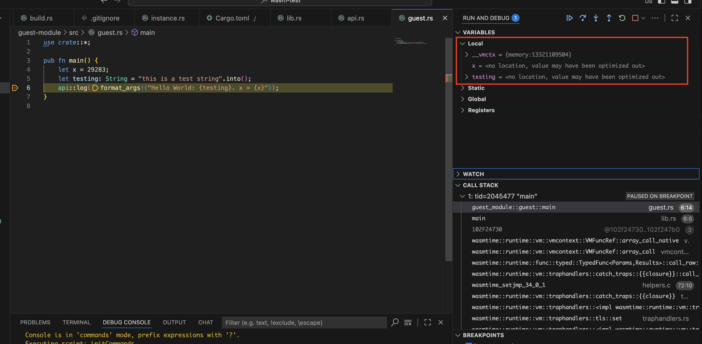

# The Problem

I cannot figure out how to get lldb to be able to see WASM local variables. Even with all debug options enabled.

Specifically I am setting a breakpoint at [guest.rs](./guest-module/src/guest.rs) on line 6 and I would expect to be able to inspect stack variables, but instead what I get is this:



Context: This is running on an arm64 M4 Powerbook laptop. I suspect it may be an arm64-specific issue but cannot confirm easily.

# Application Organization

The host application (`wasm-test` crate) is defined in the repository root in [Cargo.toml](./Cargo.toml). The guest application is a separate root crate defined within [guest-module/Cargo.toml](./guest-module/Cargo.toml).

[build.rs](./build.rs) builds the `guest-module` whenever the host builds. It builds using the `wasm32-unknown-unknown` target and ensures `profile.dev.opt-level=0` and `profile.dev.debug=true`.

[main.rs](./src/main.rs) creates a `wasmtime::Engine`, configures it for debug, makes a linker, loads the module, instantiates it, and runs an exported function called `main()`.

[lib.rs](./guest-module/src/lib.rs) defines the FFI `main()` entrypoint which just shunts over to a rust-friendly `pub fn main()` in [guest.rs](./guest-module/src/guest.rs).

[api.rs](./guest-module/src/api.rs) defines a rust `pub fn log()` which wraps an FFI import by the same name and some trivial marshalling logic.

At runtime, wasm-test starts, runs the `main()` function in the guest module, which in turn calls back into wasm-test's exported `log(msg)` function then the guest `main()` function finishes and wasm-test exits. 

Expected/observed behavior is the application should log the following:
```
HOST: Main Starting
GUEST: Hello World: this is a test string. x = 29283
HOST: Main Finished
```

# Debugger Setup

VSCode's launch.json is using the following configuration:

```json
{
    "type": "lldb",
    "request": "launch",
    "name": "Debug executable 'wasm-test'",
    "cargo": {
        "args": [
            "build",
            "--bin=wasm-test",
            "--package=wasm-test"
        ],
        "filter": {
            "name": "wasm-test",
            "kind": "bin"
        }
    },
    "args": [],
    "cwd": "${workspaceFolder}",
    "initCommands": [
        "settings set plugin.jit-loader.gdb.enable on",
    ]
}
```
